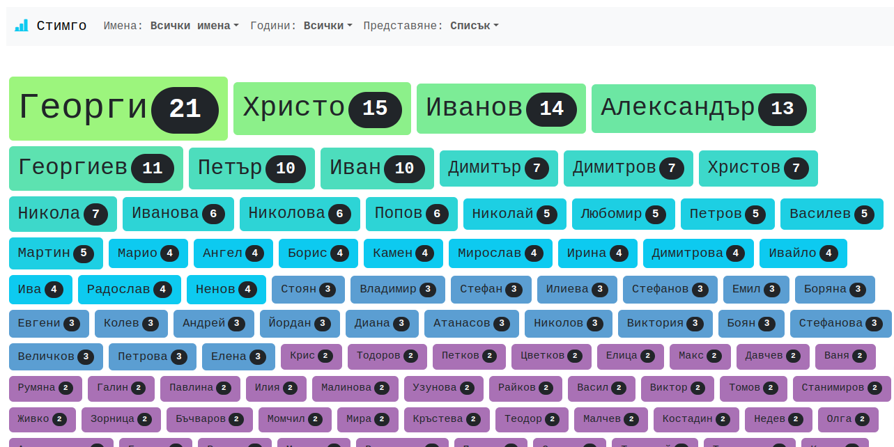

# St.Im.Go / **СТ**атистика за **ИМ**ената на **ГО**стите

Малък проект с много грозен Javascript за визуализация на статистика за имената
на гостите в подкаста [Свръхчовекът с Георги Ненов](https://thesuperhumanpodcast.net/)

## Как?

* всяка сряда се пуска скрипта [stigmo.php](stigmo.php)
* той изтегля емисията с епизодите и изважда информацията за гостите

* информацията се записва в [docs/stats.js](docs/stats.js)
* малкият сайт с много грозният javascript зарежда данните

## Защо?

Исках интересен малък проект, в който да си поиграя с някакви елементарни визуализации

## Къде?

Ето тук: [kktsvetkov.github.io/stimgo](https://kktsvetkov.github.io/stimgo/)
